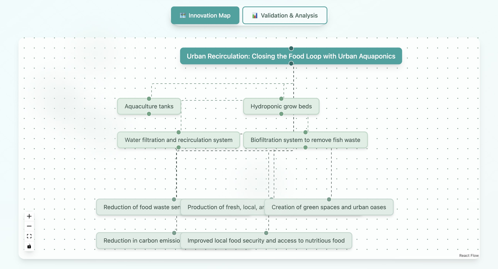
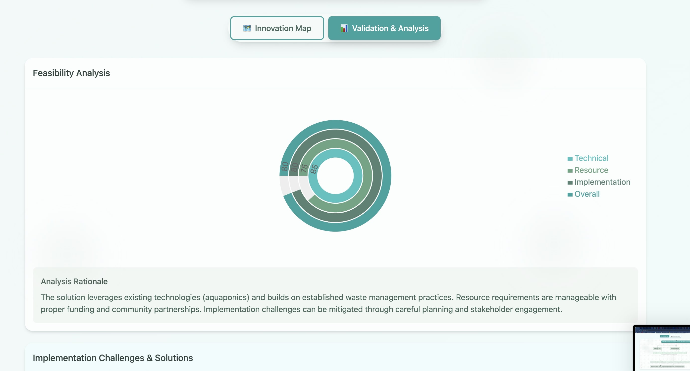
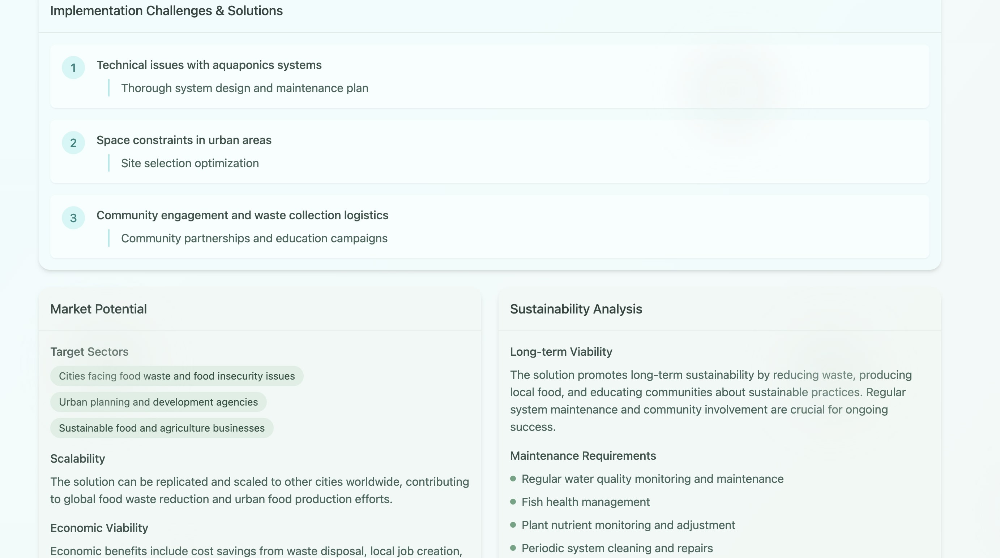
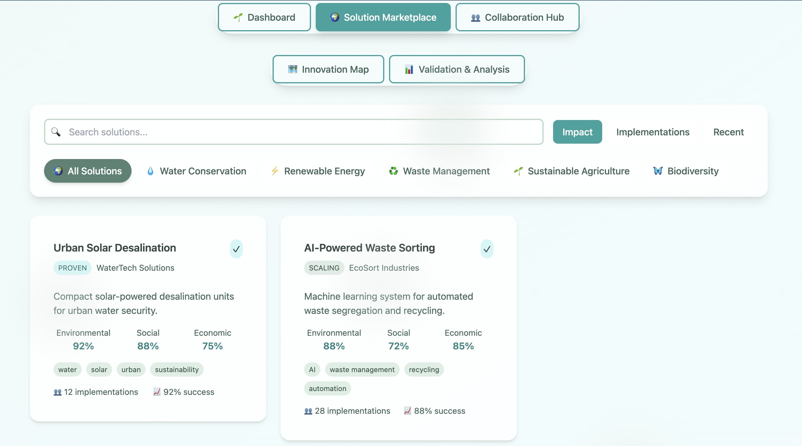
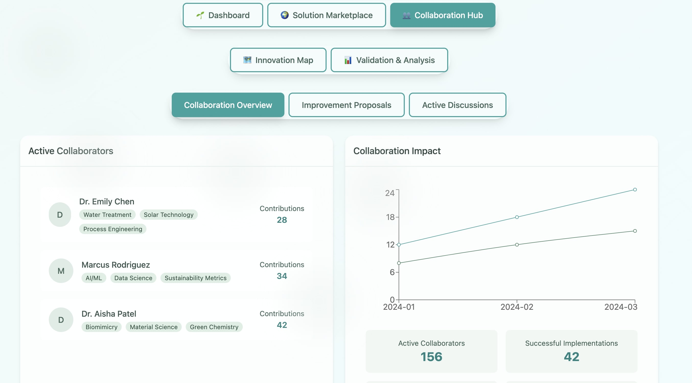

# EcoForge – AI-Driven Green Innovation Hub

EcoForge is an innovative platform designed to empower environmental innovation using the power of Artificial Intelligence. Developed as part of a hackathon, this platform combines advanced AI technologies with a strong focus on sustainability to generate, visualize, and validate environmental solutions in real-time.

## Features

- **AI-Powered Solution Generation**  
  Utilize the Gemini API to create innovative environmental solutions tailored to real-world challenges.

- **Interactive Visualization**  
  Engage with dynamic, user-friendly visual representations of proposed solutions to better understand their impact.

- **Feasibility and Validation Analysis**  
  Assess the practicality and effectiveness of generated solutions through comprehensive validation metrics.

- **Eco-Friendly Themed UI**  
  Experience a clean, intuitive interface inspired by natural elements to enhance user engagement.

- **Real-Time Processing**  
  Solutions are generated and analyzed instantly, allowing for immediate feedback and iteration.

## Technology Stack

- React with TypeScript for building a robust frontend  
- Tailwind CSS for modern, responsive styling  
- Framer Motion to add smooth animations and transitions  
- Google Gemini AI as the core generative intelligence engine  
- React Flow for interactive flow diagrams and visualization  
- Zustand for efficient state management

## Images

## License

MIT
